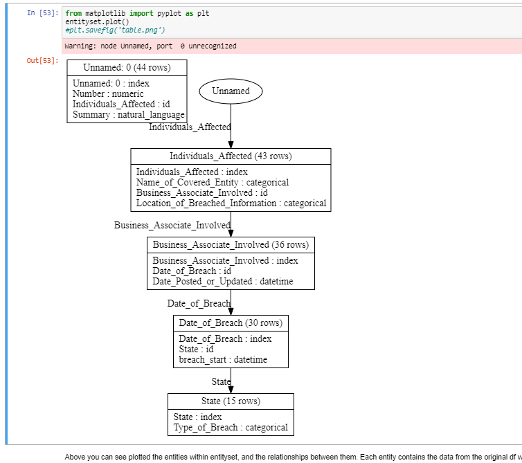

# Auto_Normalization_of_database

A normalized, relational dataset makes it easier to perform feature quires. Unfortunately, raw data for database is often stored as a single table, which makes the normalization process tedious and time-consuming & possibilty of error.

As a part of my work to make this proccess automatic ,I used pandas library to form automatatic entities. 

Here is the output of the code showing main entities of data table of csv file which i attached in repo 

